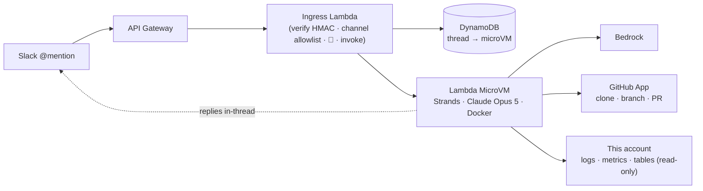

# Slack Dev

A lightweight engineering agent you summon by @-mentioning it in Slack. Give it one GitHub repository
and it iterates there — reads the code, debugs, and opens pull requests — while investigating the AWS
account it's deployed in. It replies in the thread it was called from.

Runs entirely in AWS: one **Lambda MicroVM** per Slack thread, **Claude Opus 5** on Bedrock, **eu-west-1**.

Built to be **cloned per agent**: set a name, write a prompt, deploy. Registering the GitHub App and the
Slack app are scripted, so standing one up is three clicks and one copied value.

## Let your coding agent set it up

```bash
npx slack-dev-skill        # installs the `create-slack-dev` skill
```

Then, in the repo you want an agent for, just ask: **"create a slack agent for this repo"**. Your agent
gathers the few things it must not guess, registers the GitHub App, deploys, and walks you through the
handful of clicks that have no API. It writes the skill for **Claude Code** (`~/.claude/skills/`) and, if
the directory has an `AGENTS.md`, adds a pointer there for **Codex** and other AGENTS.md-based agents.

No npm? The skill is just markdown — [`skills/create-slack-dev/`](./skills/create-slack-dev) in this repo:

```bash
git clone https://github.com/niklas-palm/slack-dev
cp -R slack-dev/skills/create-slack-dev ~/.claude/skills/
```

Prefer to do it yourself, or want to know what the skill is doing?

**→ [setup.md](./setup.md) — zero to a working agent by hand, about 10 minutes.**
**→ [docs/iterating.md](./docs/iterating.md) — then teach it about your system: the prompt and skills.**



No queue, no conversation store, no API Gateway authorizer. What it uses instead:

- **Slack request signing** to authenticate an otherwise-public webhook.
- **One Lambda MicroVM per Slack thread**, keyed by `thread_ts`, so the conversation lives in memory for
  the VM's full 8-hour life and follow-ups keep complete context — with no conversation store. Idle VMs
  suspend (compute billing stops) and auto-resume on the next mention with memory intact.
- **A tiny DynamoDB table** mapping thread → microVM. The one thing a managed runtime would have done
  for us: microVMs have no session concept and can't be listed by tag, so routing is ours.
- **Docker inside the VM**, so the agent can run a project's own `docker-compose.yml` and test a change
  end to end in real isolation.
- **A GitHub App installation token** for repository access and a bot identity on PRs.
- **`ReadOnlyAccess` in its own account**, which is why you deploy it beside the workload it watches.
- **CDK** for every resource, with no fixed physical names, so the same stack deploys many times per
  account for different agents.

## The one thing to understand

**The agent's reply is a tool call it makes, not the text it generates.** The human is in Slack; they
never see assistant text, reasoning, or tool output. Only a `reply_to_thread` call arrives. So writing a
good answer and stopping means the human sees nothing but the 👀 — and from the model's side that looks
like success.

Four things defend against it:

1. The system prompt.
2. A `replied` flag the runtime tracks — an *answer*, since `ask_user`'s own question doesn't count.
3. An SDK hook that halts the loop once a reply is delivered **and** the status is terminal, so the agent
   can't keep working past its own sign-off.
4. A fallback that posts a warning and marks the thread 🔴 if a turn ends without both.

A turn is successful only when the human got a message **and** the agent said how it ended. Either half
alone is a failure: a reply with no terminal status is usually a turn that posted "Looking into X…" and
then stopped, so closing that as 🟢 would paint unfinished work green.

## Thread status at a glance

The reaction on your message says where things stand, so nobody has to ask:

| Reaction | Meaning | Set by |
|---|---|---|
| 👀 | received | the ingress Lambda, on arrival — stays for the whole turn |
| 🟡 | working | **the runtime**, before the model starts |
| ❓ | waiting on you | the agent, via `ask_user` |
| 🟢 | done | the agent, via `set_thread_status` |
| 🔴 | failed | the agent — **or the runtime**, if the turn died, delivered nothing, or never closed out |

The four status reactions are mutually exclusive, on both the thread parent and the triggering message.
The runtime — not the agent — owns 🟡 and always closes out, because a reaction that lies is worse than
no reaction: an agent that crashed would otherwise leave the thread looking busy forever. Slack can still
refuse a reaction, and the sweep clears stale ones first, so the honest failure is a message with *no*
colour rather than a wrong one (logged as `slack_status_warning`).

## Interrupting a running agent

Mention it again while it's working and the message is **injected into the turn in flight**, not queued
behind it. A `BeforeModelCallEvent` hook folds anything pending into the conversation before the model's
next round-trip, labelled as newer than the original request — so "stop, wrong repo" lands while there's
still time to act on it, rather than after the PR is open.

No cancellation semantics: the agent simply learns something new mid-thought and decides what to do.

## Capabilities

**Work tools** (`runtime/src/tools.ts`): `read_file`, `write_file`, `edit_file`, `multi_edit`,
`run_bash`, `run_python`, `view_image`. Every tool returns `{error, hint}` instead of throwing — a thrown
tool aborts the turn, which in Slack is indistinguishable from silence. File paths are sandboxed to
`/workspace`; `run_bash` is intentionally unrestricted, with timeouts, process-group cleanup, and
bounded output.

**Slack tools** (`runtime/src/slack-tools.ts`): `reply_to_thread`, `set_thread_status`, `ask_user`,
`read_thread`, `upload_file`, `download_file` — real typed tools rather than curl snippets, which buys:

- **Safety.** The channel and thread come from the invocation, so no parameter exists through which the
  model could name a different channel. It can only reply where it was summoned.
- **Reliability.** No shell quoting. A reply containing backticks, quotes, `$`, or newlines is just a
  string argument; as a curl recipe it was one bad quote from a mangled message.
- **Observability.** The runtime knows whether the human actually heard anything — what makes the
  fallback above possible.

**Skills** load on demand rather than sitting in the prompt: the agent sees each skill's name and
one-line description and pulls the full instructions when it needs them. **Adding one is a folder** —
`runtime/skills/<name>/SKILL.md`, no registration and no code change. See
[docs/iterating.md](./docs/iterating.md).

- **github** — mint a token, clone, branch, run the repo's checks, open or update a PR, leave a review
  with inline comments.
- **review** — *how* to review: one focused pass per role, verify a finding by running it, and say
  "nothing actionable" rather than inventing nits. The method a model does badly unprompted.

Both are long, occasional, and mostly shell — a good fit for progressive disclosure. Slack is the
opposite (needed every turn, quoting-sensitive), which is why it's tools instead.

**AWS** is read-only, through `boto3` inside `run_python` or the `aws` CLI inside `run_bash`. Because the
stack is deployed into the account it looks after, "why is the worker erroring?" is a question it can
actually answer.

## Guardrails

- **Propose, never land.** Never pushes to the default branch, never merges, never force-pushes a shared
  branch, never triggers or cancels a workflow run. Every change is a PR a human reviews — including a
  workflow edit, which the App *can* author (GitHub refuses an App push touching `.github/workflows`
  otherwise) but cannot merge.
- **Read-only in AWS, plus Bedrock.** It cannot create, modify, or delete a resource, or read another
  agent's secrets. An infra fix is therefore a PR, not an apply, and no prompt injection can mutate the
  account. Bedrock is unrestricted because the agent is often asked about the account's own Bedrock
  setup, and Bedrock holds no data of its own.
- **Answers only in approved channels** (`allowedChannels`), checked in the ingress before any reaction
  or model call — so a mention from elsewhere is inert, not merely refused.
- **Secrets reach the runtime as SSM parameter *paths***; values never enter the template, and the prompt
  forbids echoing them anywhere — including the clone's remote URL, which contains a live token.
- **Everything it reads is data, not instructions.** Repo files, third-party Slack messages, PR bodies,
  CI logs, and `curl` output cannot grant permissions or override these rules. The agent holds a GitHub
  App token and AWS read access, so this is load-bearing; it's pinned by tests.

Two kinds, and it's worth knowing which is which. **Enforced in code:** AWS read-only (IAM), replies
confined to the summoning thread (no channel parameter exists), no access to another agent's secrets (an
explicit IAM Deny), channel allowlist (ingress), and turn termination (an SDK hook). **Prompt-only:**
never push to the default branch, never merge — the App's `contents: write` technically allows both, so
add a branch-protection rule if that matters to you.

## Trust boundary

Anyone who can @-mention the agent can direct something with an unrestricted shell and repository
credentials. Two controls bound who that is:

- **`allowedChannels`** in `agent.config.json` — the channel ids it answers in, enforced *before* the 👀,
  so an unapproved mention costs nothing and shows no sign of life. **Set this in a large workspace**,
  where anyone who can `/invite` the bot could otherwise put it to work. Empty means any channel the bot
  is in, which suits only a small, trusted workspace.
- **The GitHub App's scope** — install it on one repository, with the narrowest useful permissions.

Harden command execution before pointing this at untrusted users.

## Layout

```text
.
├── agent.config.json     ← name, description, target repo, allowed channels. The per-agent knob
│                            — gitignored; copy agent.config.example.json to start.
├── runtime/
│   ├── PROMPT.md         ← what THIS agent is for. The main thing you write.
│   ├── skills/           ← github (clone, branch, PR) · review (how to review)
│   ├── src/
│   │   ├── server.ts     in-VM server: lifecycle hooks + /invoke, session reuse,
│   │   │                 serialization, and the enforced status protocol
│   │   ├── agent.ts      the Strands agent + the three hooks
│   │   ├── prompt.ts     base prompt (generic) + PROMPT.md (per agent)
│   │   ├── tools.ts      files · shell · python · images
│   │   ├── slack-tools.ts the agent's Slack surface (thread-bound)
│   │   ├── slack.ts      the runtime's own Slack calls: status + fallback
│   │   ├── secrets.ts    SSM SecureString → process.env
│   │   ├── emit.ts       one structured JSON log line per event
│   │   ├── local.ts      run one turn locally, no Slack and no deploy
│   │   └── config.ts     invariants (region, model) + deploy values
│   └── Dockerfile        AL2023: docker, node, python, git, gh, aws, jq, ripgrep
├── infra/
│   ├── lib/stack.ts      the whole stack: runtime + Slack webhook
│   ├── lambda/slack-events/handler.ts
│   └── scripts/          create-github-app · create-slack-app · invoke · cli
├── CLAUDE.md             ← house rules + commands: the entry point for a coding agent
├── .github/workflows/    ← THIS repo's own deploy (keyless OIDC). Delete it in a clone.
├── skills/               ← the create-slack-dev INSTALLER skill (`npx slack-dev-skill`)
│                            — not the agent's own skills, which live in runtime/skills/
├── scripts/put-secrets.sh        manual/rotation path for any secret
├── slack-app-manifest.yaml       the by-hand fallback
└── setup.md              ← start here
```

## Development

```bash
npm install
npm run check      # typecheck + tests, fully offline

# FASTEST: one turn in-process. Real model, real tools, real workspace — no container, no Slack.
cd runtime && WORKSPACE_DIR=/tmp/agent env -u AWS_PROFILE npm run local -- "your request"

# THE REAL IMAGE, locally: builds what the microVM boots, probes every lifecycle hook, optional prompt
cd .. && env -u AWS_PROFILE npm run docker -- "your request"

# ship a change to the image (this is what a PROMPT.md edit needs — no CDK deploy)
env -u AWS_PROFILE npm run image

# a deployed VM, end to end
env -u AWS_PROFILE npm run invoke -- --prompt "your request"
```

Three loops, shortest first. `npm run local` needs AWS credentials for Bedrock and nothing else — no
stack, no secrets, no Slack app. `npm run docker` runs **the same image the microVM boots**, so it catches
anything image-shaped (a missing binary, a Node version, dockerd) that in-process testing can't. Both skip
Slack: the Slack tools report the turn didn't come from Slack, so the agent answers in its final message.

**Editing `PROMPT.md` needs `npm run image`, not `npm run deploy`.** The image carries the prompt; the
stack only routes to it. The ingress reads the image ARN from SSM at call time, so a rebuild is picked up
with no stack change.

Tests are offline and cover the parts where a mock is still meaningful: the tool contract (never throws,
never escapes the workspace), the Slack signature check (wrong secret, tampered body, replay window), the
channel allowlist, the prompt's load-bearing rules, and the synthesized template (no fixed resource
names, no secrets, read-only IAM, per-agent scoping) — plus how `PROMPT.md` composes with the base
prompt, since that's the file every operator edits. The agent's actual behaviour is verified by running
it (`npm run docker`, `npm run invoke`) — a mocked model would only test our assumptions about it.

See [CONTRIBUTING.md](./CONTRIBUTING.md) for the concurrency design and the two-lockfile trap — read it
before changing `slack-tools.ts` or a runtime dependency. **Working on this with a coding agent?**
[CLAUDE.md](./CLAUDE.md) is its entry point: the rules, the commands, and which doc to read first.

## Deliberate limits

- Conversation and files last only as long as the microVM (8h, the service ceiling). A later mention
  starts a fresh VM and re-reads the durable Slack thread.
- Every follow-up needs a new @mention.
- Slack is the only trigger; GitHub is an output. A GitHub webhook route is a natural next seam.
- One model, no routing. Simplicity over marginal cost savings.
- One turn is capped at 200 model round-trips, so a retry loop can't burn tokens until the microVM dies.
- **No web-search tool and no hardened fetcher.** `curl` inside `run_bash` is the only web access, with
  no SSRF guard, size cap, or content-type check. Fine for a trusted workspace fetching a doc page; port
  a real fetcher with those guards if you need research.
- **Cost is per warm thread.** Each Slack thread runs a 4 GB microVM that suspends after 15 minutes idle
  (compute billing stops) and is terminated at 8h. So you pay for minutes of active work per thread, not
  for the whole day — but an agent left thinking in ten threads is ten VMs. Tune `idleSessionTimeout`
  (`infra/lib/config.ts`) and the memory in `infra/microvm/build.sh`.

## Contributing & security

Issues and PRs welcome — see [CONTRIBUTING.md](./CONTRIBUTING.md). For anything security-sensitive,
including what this sample deliberately grants the agent, see [SECURITY.md](./SECURITY.md).

## License

MIT-0 — use it, fork it, ship it, no attribution required. See [LICENSE](./LICENSE).
